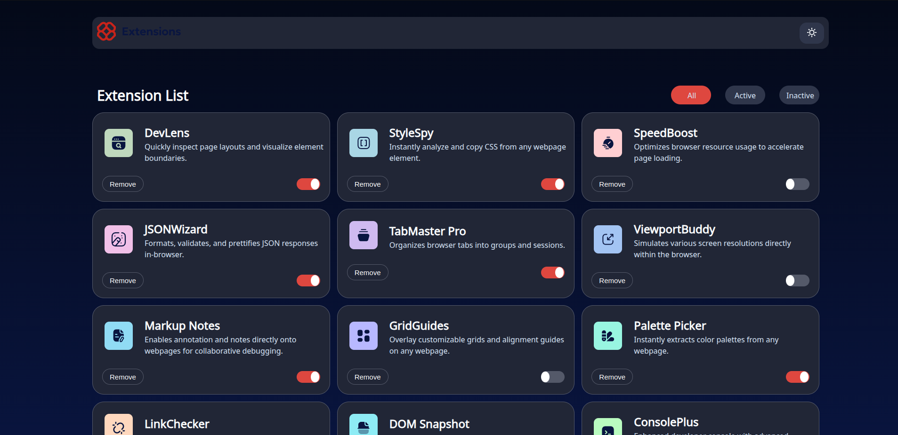

# Frontend Mentor - Browser extensions manager UI solution

This is a solution to the [Browser extensions manager UI challenge on Frontend Mentor](https://www.frontendmentor.io/challenges/browser-extension-manager-ui-yNZnOfsMAp). Frontend Mentor challenges help you improve your coding skills by building realistic projects.

## Table of contents

- [Overview](#overview)
  - [The challenge](#the-challenge)
  - [Screenshot](#screenshot)
  - [Links](#links)
- [My process](#my-process)
  - [Built with](#built-with)
  - [What I learned](#what-i-learned)
  - [Continued development](#continued-development)
  - [Useful resources](#useful-resources)

## Overview

### The challenge

Users should be able to:

- Toggle extensions between active and inactive states
- Filter active and inactive extensions
- Remove extensions from the list
- See hover for all interactive elements on the page

### Screenshot



### Links

- Live Site URL: [Preview](https://azanra.github.io/extension-manager/)

## My process

### Built with

- Javascript Classes

### What I learned

Using class to construct an object, it field and method. Same as previous
refactored project. it's not really a class but rather it converted into function constructor and prototype to set it's method.

Using private property. By using private property that prefixed with hash
it can only be accessed inside of the class that declares it. those will help to make sure that no one can access or rewrite it except on the getter and setter that i already defined.

```js
export class Extension {
  #isActive;

  constructor(id, src, name, description, isActive) {
    this.id = id;
    this.src = src;
    this.name = name;
    this.description = description;
    this.#isActive = isActive;
  }

  setActive() {
    this.#isActive = !this.#isActive;
  }

  getActive() {
    return this.#isActive;
  }
}
```

Creating custom radio and custom checkboxes. By hiding the default appearance of the input. and make the size of the input to match it parent to make the
hitbox larger. and style the span or input to create a custom appearance.

```css
.labelSwitch,
.toggleSlider,
.toggleSwitch {
  width: 50px;
  height: 25px;
  margin: 0;
}

.toggleSlider {
  position: relative;
  display: inline-block;
  bottom: 32px;
  background-color: var(--Neutral-600);
  border-radius: 25px;
}

.toggleSlider::after {
  content: "";
  position: absolute;
  width: 18px;
  height: 23px;
  background-color: white;
  top: 1px;
  border-radius: 50%;
  transition: all 0.3s;
}

.toggleSwitch:checked + .toggleSlider::after {
  left: 30px;
}

.toggleSwitch:checked + .toggleSlider {
  background-color: var(--Red-500);
}
```

### Continued development

- Add the functionality for theme switcher button
- User should be able to add their own extension

### Useful resources

- [Add text inside radio](https://stackoverflow.com/questions/45259139/how-to-put-text-inside-radio-button) - Baseline on how i style the filter radio element
- [Checkbox as toggle button](https://medium.com/front-end-weekly/creating-a-toggle-switch-in-css-2d23e496d035) - Well explained step by step on how to create custom toggle button from checkbox input
